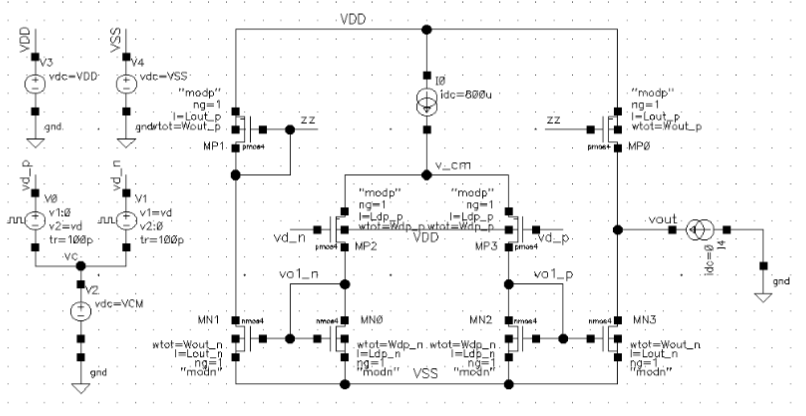
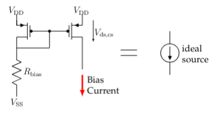
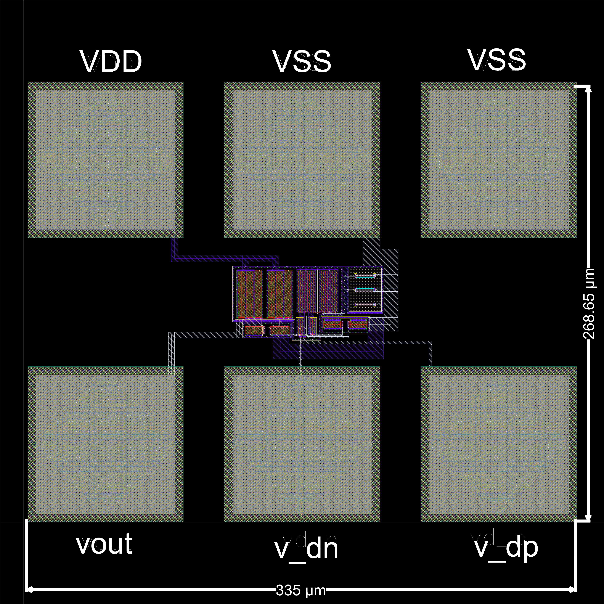
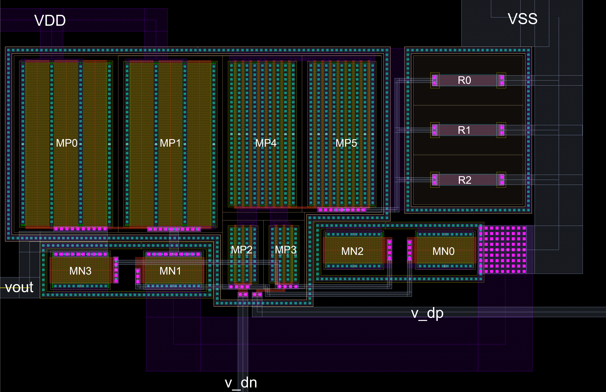

# One-Stage Symmetrical Operational Amplifier Design

This repository contains a complete one-stage symmetrical operational amplifier (OPAMP) design project, developed using Cadence EDA tools with AMS C35B4C3 CMOS technology. The project encompasses schematic design, simulation, and layout implementation of a PMOS differential pair-based operational amplifier.

## Project Overview

This OPAMP design was developed as part of the Integrated Electronic Systems course at Instituto Superior Técnico, Master's in Electronic Engineering. The design follows a systematic approach from initial schematic conception through parasitic-aware post-layout verification.

### Key Features

- **Topology**: One-stage symmetrical operational amplifier
- **Differential Stage**: PMOS differential pair with current source biasing
- **Technology**: AMS C35B4C3 CMOS (3.3V process)
- **Output**: Differential input, single-ended output
- **Supply Voltage**: 3.2V
- **Bias Points**: Input/Output common mode at 1.6V

## Technology Components

The design utilizes the following components from the AMS libraries:

- **Transistors**: 3.3V NMOS (nmos4) and PMOS (pmos4) from PRIMLIB
- **Capacitors**: Poly1-Poly2 capacitors (cpoly) from PRIMLIB
- **Resistors**: Poly-1, Poly-2, or Poly-H resistances (rpoly1, rpoly2, rpolyh) from PRIMLIB
- **Pads**: PAD components (g_padonly) from IOLIB_ANA_4M

## Specifications

The OPAMP meets the following design specifications:

| Parameter | Specification |
|-----------|--------------|
| Supply Voltage | 3.2V |
| Differential Pair Bias Current | 0.8 mA |
| Minimum Low Frequency Gain | 38 dB |
| Maximum Supply Current | 5 mA |
| Input Common Mode Voltage | 1.6V |
| Output Common Mode Voltage | 1.6V |
| Output Voltage Swing | Maximized |
| Input Referred Offset | Minimized |

## File Structure

```
├── Documentation/          # Detailed project report (PDF)
├── Cadence/               # Cadence design files
│   ├── Schematics/        # Circuit schematics
│   ├── Simulations/       # Simulation testbenches and results
│   └── Layout/            # Physical layout files
└── Images/                # Documentation images
    ├── schematic_ideal_cm  # Initial schematic with ideal current source
    ├── real_current_mirror # Implemented bias circuit
    ├── layout.png         # Complete layout view
    └── layout_closeup.png # Detailed layout view
```

## Design Methodology

### Phase 1: Schematic Design

1. **Initial Design**: Circuit schematic created with parameterized PMOS and NMOS dimensions, starting with default sizes (W=10µm, L=0.35µm, nf=1)
2. **DC Analysis**: Bias point verification and adjustment of differential pair transistor dimensions
3. **Output Bias Tuning**: Adjustment of output stage transistor widths to achieve 1.6V output bias
4. **Gain Optimization**: Fine-tuning of output transistor dimensions (L and W) to meet gain specifications
5. **Bias Circuit Design**: Replacement of ideal current source with practical current mirror implementation
6. **Hierarchical Conversion**: Transformation into modular hierarchical topology

### Phase 2: Schematic Simulations

Comprehensive simulation suite includes:

1. Bias point analysis
2. Frequency response: differential gain Ad(f), common mode gain Ac(f), and CMRR(f)
3. Impedance characteristics: input (differential and common mode) and output impedances
4. Input referred offset voltage
5. Power supply rejection ratios (PSRR)
6. Input common mode range (ICMR) and output voltage swing
7. Phase margin and stability analysis
8. Slew rate measurements (rise/fall)
9. Power consumption analysis
10. PVT corners simulation (Process, Voltage ±10%, Temperature -40°C to 125°C)

### Phase 3: Layout Design

1. **Physical Implementation**: Complete layout design with parasitic extraction
2. **Pad Frame Integration**: Layout placed within pad frame with 120µm pad pitch
3. **Post-Layout Verification**: Simulation with extracted parasitics
4. **Comparative Analysis**: Pre-layout vs post-layout performance comparison for Ad(f), Ac(f), CMRR(f), and phase margin

## Schematics

### Initial Design with Ideal Current Source


The initial topology uses an ideal current source for the differential pair biasing, enabling rapid optimization of transistor dimensions.

### Implemented Current Mirror Bias Circuit


After successful dimensioning, the ideal source is replaced with this practical current mirror implementation.

## Layout

### Complete Layout


The final layout includes proper pad placement, signal routing, and optimized component placement for matched performance.

### Layout Detail


Detailed view showing transistor layout, interconnections, and design-for-matching techniques.

## Documentation

The complete design report (maximum 25 pages) includes:

- Design trade-offs and justifications
- Complete schematic diagrams and testbench configurations
- All simulation results with detailed analysis
- Layout views with dimensions and pad assignments
- Pre-layout vs post-layout performance comparison
- Conclusions and achieved specifications

The full report is available in the `Documentation` folder.

## Design Tools

- **EDA Platform**: Cadence Virtuoso
- **Simulator**: Spectre
- **Technology**: AMS C35B4C3 CMOS 0.35µm

## Performance Highlights

The design achieves all specified requirements including:
- Target differential gain (36-38 dB minimum depending on group)
- Maximized output voltage swing
- Low input offset voltage
- Stable operation across PVT corners
- Layout-verified performance with parasitic effects

---

**Academic Context**: This project was completed as part of the coursework for Integrated Electronic Systems (Sistemas Eletrónicos Integrados) at Instituto Superior Técnico, 2025/2026.
